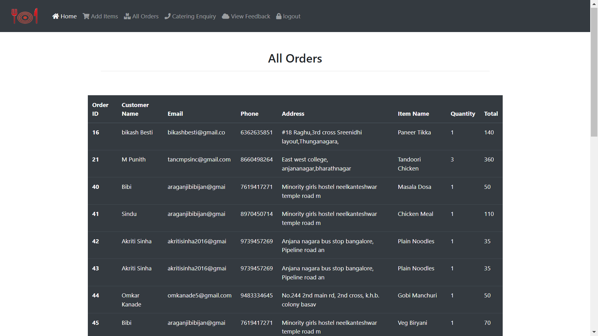

# EatLunchbox
An online food delivery system designed as a website that allows customers to view the menu and place orders. It also features an admin interface for restaurants to manage and fulfill customer orders efficiently.

# Features

* Customer Interface: Browse the menu, select items, and place orders.

* Admin Interface: Manage orders, update the menu, and track customer requests.

* Database Integration: Utilizes MySQL for secure and efficient data management.

# Technologies Used

* Frontend: PHP, CSS

* Backend: PHP

* Database: MySQL

# Demo Links

* Customer Form: http://eatlunchbox.infy.uk/

* Admin Page: http://eatlunchbox.infy.uk/ADMIN/admin-login

# How to Run the Project

To run this project locally, you need to set up a XAMPP server. Follow the steps below:

1. Download and Install XAMPP

  * Download XAMPP from Apache Friends.

  * Install it on your system and launch the control panel.

2. Start Apache and MySQL Servers

  * Open the XAMPP control panel and start the Apache and MySQL servers.

3. Set Up Project Files

  * Navigate to the htdocs directory inside your XAMPP installation folder.

  * Create a folder named eatlunchbox (or any name you prefer).

  * Place all the project files in this folder.

4. Import the Database

  * Open your web browser and go to http://localhost/phpmyadmin.

  * Create a new database named lunchboxdb.

  * Import the provided .sql file to set up the database structure and initial data.

5. Access the Project

  * For the customer interface: Open your web browser and visit http://localhost/eatlunchbox/.

  * For the admin interface: Visit http://localhost/eatlunchbox/ADMIN/admin-login.

# Screenshots

Below are some screenshots showcasing the project:

# Customer Interface

Screenshot of the customer interface where users can browse the menu and place orders.

# Admin Login Page

Screenshot of the admin login page.

# Order Management (Admin Panel)

Screenshot of the admin panel displaying order management features.

# Additional Notes

  * XAMPP: XAMPP is an open-source cross-platform web server solution stack package developed by Apache Friends. It includes the Apache HTTP Server, MariaDB database, and interpreters for scripts written in PHP and Perl.

  * MySQL Database: The project uses a MySQL database named lunchboxdb. Ensure it is properly imported before running the project.

# Step-by-Step Recap for Running the Project

  1. Download and install XAMPP.

  2. Start Apache and MySQL services.

  3. Save project files in the htdocs directory.

  4. Import the lunchboxdb database using phpMyAdmin.

  5. Access the project via the browser using the appropriate URL.

# Contact

For further assistance or inquiries, feel free to contact me.